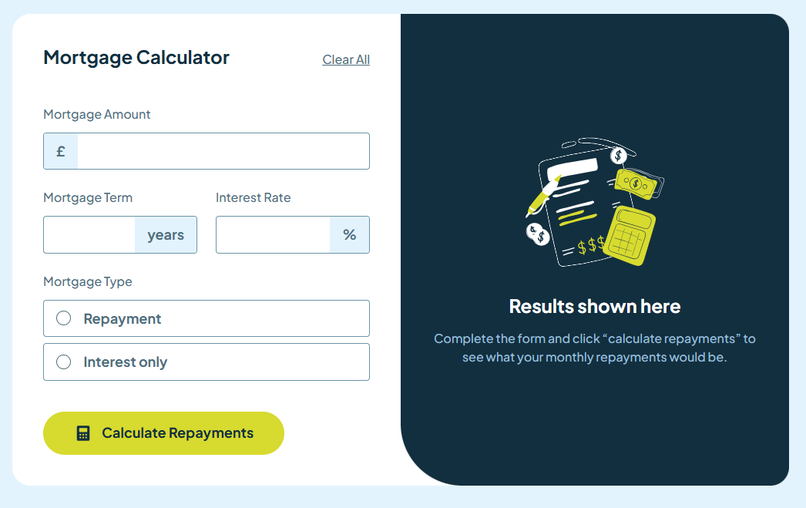

# Frontend Mentor - Mortgage repayment calculator solution

This is a solution to the [Mortgage repayment calculator challenge on Frontend Mentor](https://www.frontendmentor.io/challenges/mortgage-repayment-calculator-Galx1LXK73). Frontend Mentor challenges help you improve your coding skills by building realistic projects.

## Table of contents

- [Overview](#overview)
  - [The challenge](#the-challenge)
  - [Screenshot](#screenshot)
  - [Links](#links)
- [My process](#my-process)
  - [Built with](#built-with)
  - [What I learned](#what-i-learned)
  - [Continued development](#continued-development)
  - [Useful resources](#useful-resources)
- [Author](#author)

## Overview

### The challenge

Users should be able to:

- Input mortgage information and see monthly repayment and total repayment amounts after submitting the form
- See form validation messages if any field is incomplete
- Complete the form only using their keyboard
- View the optimal layout for the interface depending on their device's screen size
- See hover and focus states for all interactive elements on the page

### Screenshot

### Links

- Source Code: [GitHub Repo](https://github.com/morauszkia/fm-mortgage-calculator)
- Live Site URL: [GitHub Pages](https://morauszkia.github.io/fm-mortgage-calculator/)

## My process

### Built with

- Vue.js (frontend framework)
- FormKit (form handling library for Vue.js)
- Vite (build tool)
- TypeScript
- Scoped CSS Styles (for most of the styling)
- Tailwind CSS (for the custom FormKit component)
- Semantic HTML5 markup
- Mobile-first workflow

### What I learned

I wanted to use a form handling library, and chose FormKit. FormKit is great and comes with several features. The hardest part was, that the text input provided by FormKit wouldn't show my prefixes and suffixes in the inputs, so I decided to build a custom component with FormKit. I learned how to create the template of a custom component, and how to link the appropriate properties (e.g. link the elements to the FormKit input slots) coming from FormKit to make it work.

For its styling I used TailwindCss. I am fairly beginner with Tailwind and learned a lot, how to use its utility classes with custom properties, how to avoid clashes with font styling (i.e. how to give hints to Tailwind, if the namespace of two classes is the same). Also, styling with Tailwind based on sibling and parent states was completely new to me, and also to use data attributes for conditional styling.

FormKit was great for validating my inputs and displaying error messages.

Another challenge was to implement the number formatting: add comas as thousands separators to large numbers, and still be able to do the necessary calculations.

The original design didn't include the additional input for the case the user chooses "Interest Only" Mortgage Type, so I had to look up the calculations and come up with a solution for this case.

### Continued development

It would be nice to add some additional validation to the form, especially in the case of the formatted numbers. Unfortunately, while my regexes worked with online regex checker websites, they didn't work in this project. I will need to work on this, or possibly to look into some third party solution.

Also, I like to use dark themes, so implementing a theme switcher would also be a nice addition.

### Useful resources

- [FormKit Docs](https://formkit.com/getting-started/what-is-formkit)
- [Vue.js Docs](https://vuejs.org/guide/introduction.html)

## Author

- Frontend Mentor - [@mantis](https://www.frontendmentor.io/profile/morauszkia)
- X - [@mantis_hu86](https://x.com/mantis_hu86)
- Github - [@mantis](https://github.com/morauszkia)
- LinkedIn - [András Morauszki](https://www.linkedin.com/in/andras-morauszki/)
